# Cars Database Application (EN-US)


Sistema fullstack para o controle e o acompanhamento de usuários e carros registrados, com controle de permissões baseado em roles e API REST autenticada.

## Instalação

```bash
git clone https://github.com/RaphaelReggiani/app_cars_db
python -m venv venv
source venv/bin/activate  # ou venv\Scripts\activate no Windows
python manage.py migrate
python manage.py runserver
```

## Estrutura do Projeto

```bash
app_cars_db/
├── core/
│   ├── settings.py
│   └── urls.py
│
├── cars/
│   ├── urls.py
│   ├── models.py
│   ├── forms.py
│   ├── views.py
│   ├── choices.py
│   ├── validators.py
│   ├── api_views.py
│   ├── api_urls.py
│   ├── serializers.py
```

## Stack Utilizada

- Python 3.13.4;
- Django;
- Django REST Framework (DRF);
- MySQL;
- HTML5 + CSS3;
- Autenticação via TokenAuthentication (DRF).

## 🔧 Funcionalidades

- Cadastramento de usuários no site;
- Seção de login e signup de usuários (com as devidas validações de nome, e-mail, telefone, username e senha, icluindo hashing de senha);
- O registro de carros só ocorre quando o usuário estiver logado;
- É possível realizar uma consulta de todos os carros já cadastrados no site, porém com limitações de visualizações e impedimento de edição;
- Permissões de usuários, onde: um usuário não pode modificar as informações pessoais e/ou carros cadastrados por outros usuários, podendo apenas consultar as informações de carros cadastrados por outros usuários;
- Funcionalidade de: Esqueceu a senha?;
- Funcionalidade de filtros para pesquisas de carros cadastrados (geral e do usuário);
- Opção de edição das informações do carro, com permissão apenas para o usuário dono do carro;
- Opção de atualização de dados do usuário (nome, e-mail, telefone e país de origem).

## Imagens da Aplicação

### Página Inicial - Sem login
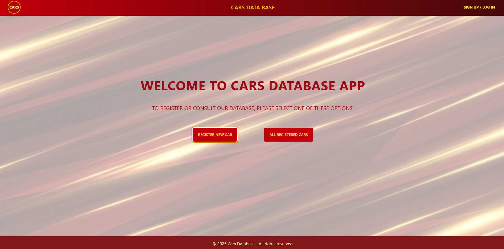

### Página Inicial  
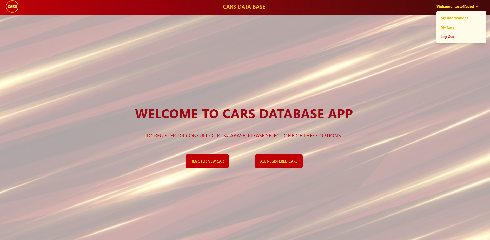

### Cadastro de Usuários - Parte 1
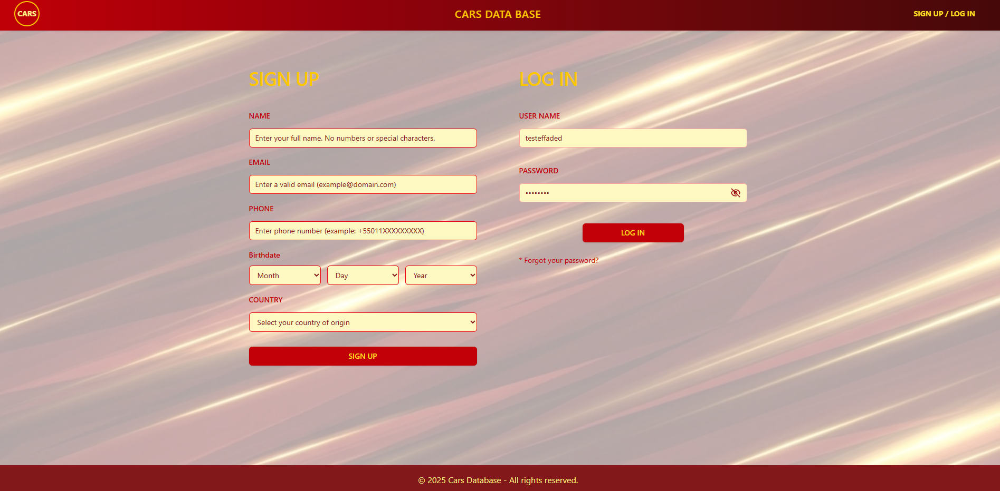

### Cadastro de Usuários - Finalização (Nickname e password)
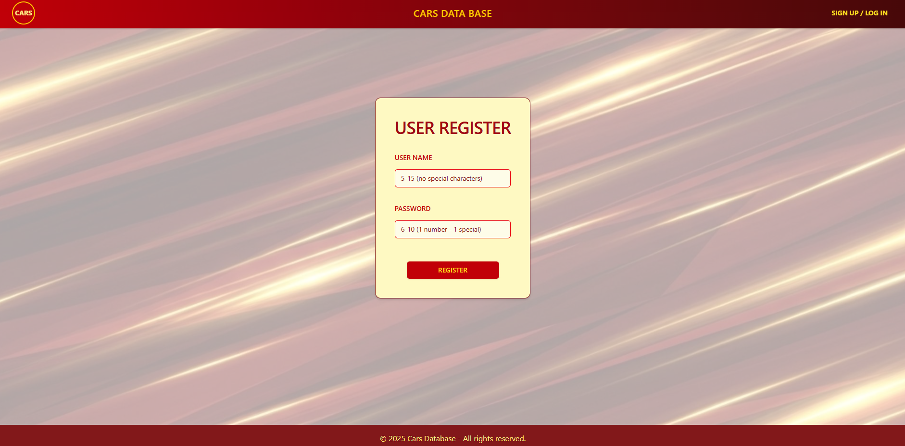

### Informações do Usuário  
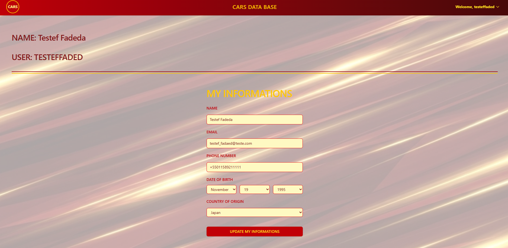

### Página de Esqueceu a senha?  
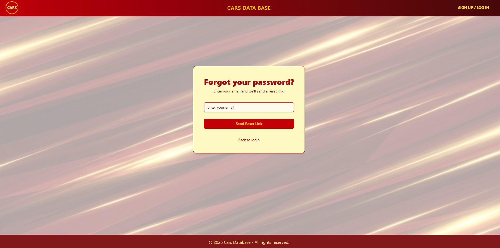

### Registro de Carro  
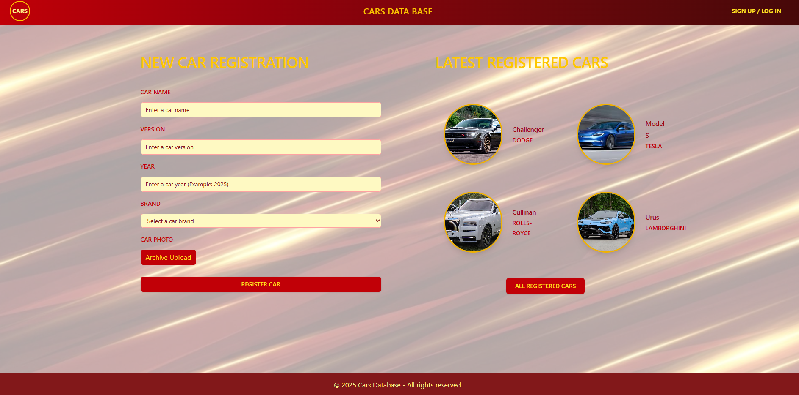

### Registro de Carro - Sucesso no registro
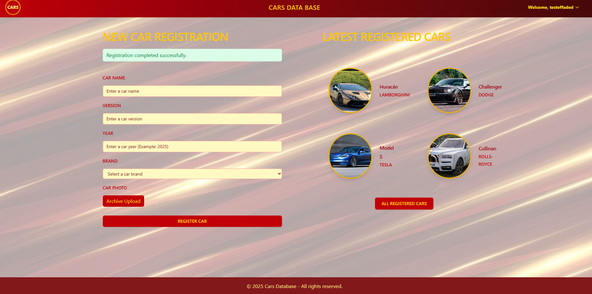

### Registro de Carro - Error (sem login)
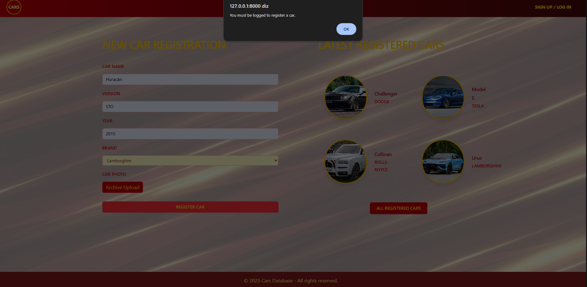

### Página de todos carros cadastrados  
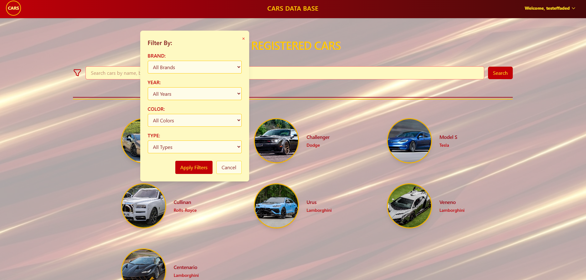

### Página de todos carros cadastrados pelo usuário (My cars)
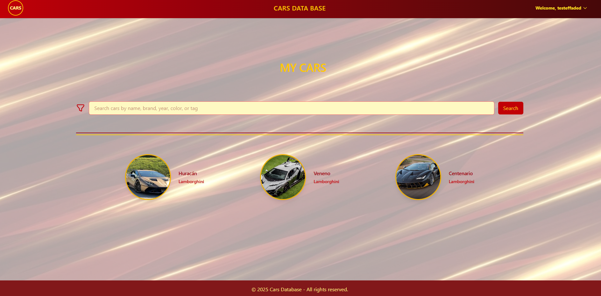

### Visualização das informações do carro sem login
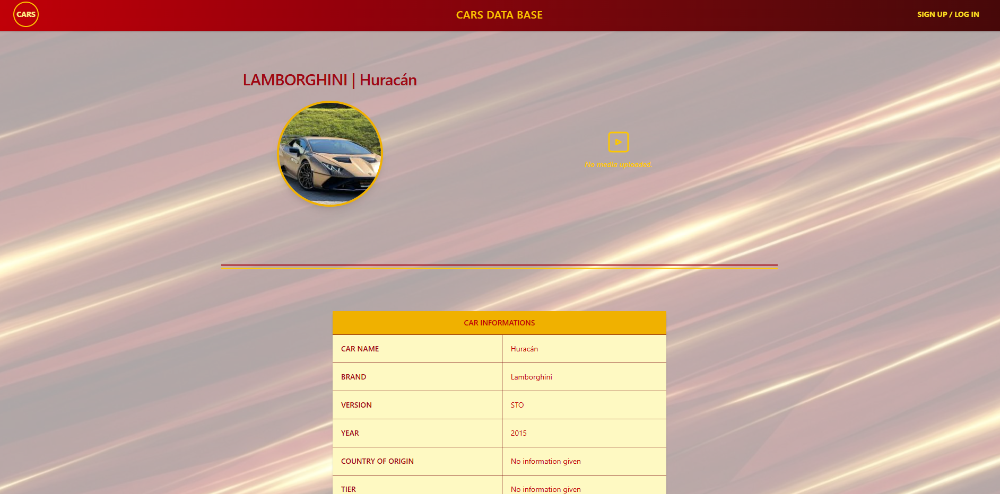

### Visualização das informações do carro logado
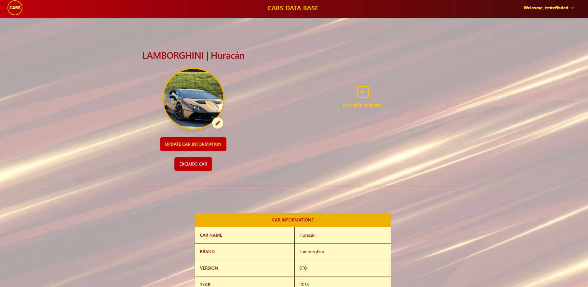

### Visualização das informações do carro logado, porém não sendo o dono do carro
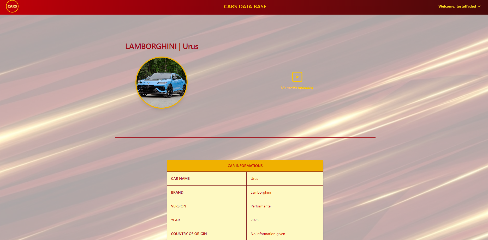

### Atualização das informações do carro (apenas logado e dono do carro) - parte 1
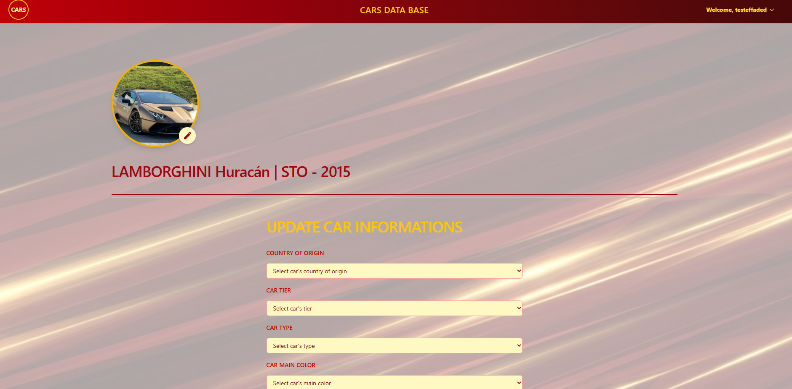

### Atualização das informações do carro (apenas logado e dono do carro) - parte 2
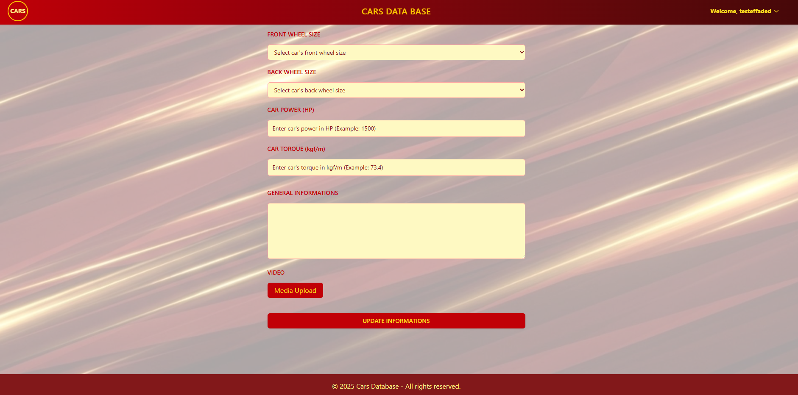

### Atualização das informações principais do carro (apenas logado e dono do carro)
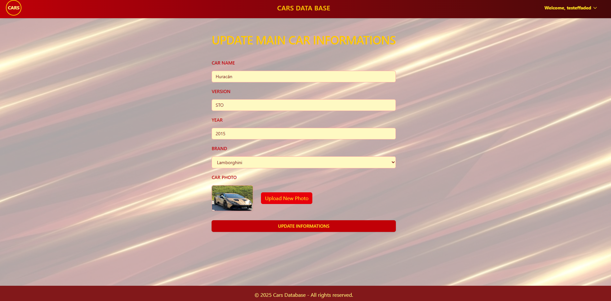
